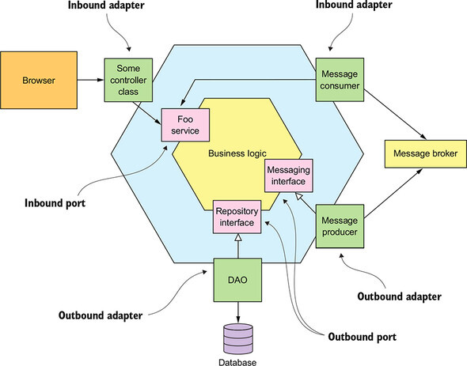
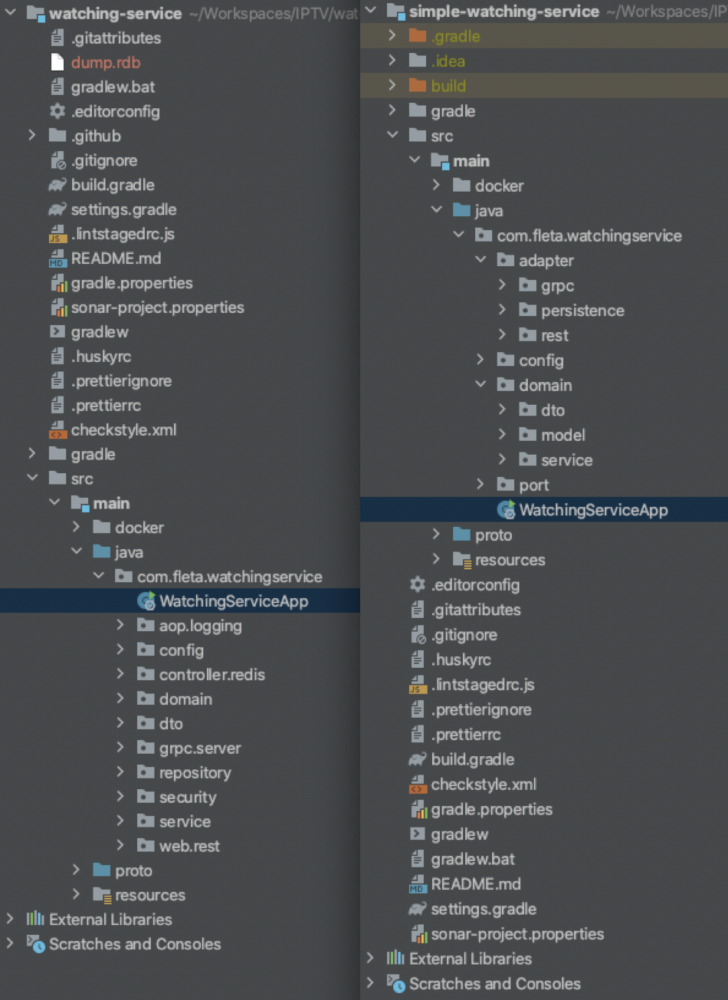
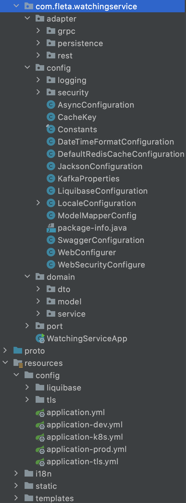

# LGU+ Media Service :: Contents 조회 서비스

# Hexagonal Architecture
The hexagonal architecture divides the system into loosely-coupled interchangeable components; such as application core, user interface, data repositories, test scripts and other system interfaces etc.

In this approach, the application core that contains the business domain information and it is surrounded by a layer that contains adapters handling bi-directional communication with other components in a generic way.

#### Why Use Hexagonal Architecture ?
This pattern allows to isolate the core logic of application from outside concerns. Having the core logic isolated means you can easily change data source details <b>without a significant impact or major code rewrites to the codebase</b>. Your business rules simply don’t know anything at all about the outside world.

# Improvement Points
+ Make source code more testable, manageable and easily maintainable

+ Correct NamingConvention for `methods`, `classes`

+ Use `@Cachable` annotation instead of `RedisTemplate`

+ Apply `ConnectionPool` for Redis
+ Good performance

<b>NOTE</b>: It is easy to change to new architecture

# Structure

The project package structure also reflects the service architecture.

## 1) domain
The domain is the core of the hexagon, containing primary business logic

### 1.1) Model
- com.lguplus.fleta.domain.model.*
- com.lguplus.fleta.domain.dto.*

### 1.2) Service Implementation
- com.lguplus.fleta.domain.serviceimpl.*

## 2) adapters
Adapters are either external APIs of your application or clients to other systems. They translate the interfaces of external systems (e.g. a search index or a file server API) to the interfaces required or exposed by the domain. Those interfaces are called ports.

### 2.1) Message Broker
The package contains implementations of `Message Broker`
- com.lguplus.fleta.adapters.messagebroker.*

### 2.2.) Persistence / Postgres
In our example, SQL is the secondary adapter.

- com.lguplus.fleta.adapters.repositoryimpl.*

### 2.3) APIs
- com.lguplus.fleta.adapters.rest.*

### 2.4) WebClient
The package contains implementation for getting data from external RESTful APIs.

- com.lguplus.fleta.adapters.webclient.*

### 2.5) Redis
Describe how to apply `Redis` into this project
- 구현
    - com.lguplus.fleta.config.DefaultRedisCacheConfiguration
        - @EnableCaching으로 Cache 사용을 활성화 합니다. cacheManager의 configuration을 통해 캐시 정책을 변경 합니다.
    - @Cachable
        - Redis에 캐싱된 데이터가 있으면 반환하고, 없으면 DB에서 조회한다음 Redis에 캐시합니다. 어노테이션은 Method나 Type에 세팅할 수 있고 런타임에 수행됩니다.

## 3) ports

An input port (driving port) lets the application core to expose the functionality to the outside of the world.

An output port (driven port) is another type of interface that is used by the application core to reach things outside of itself (like getting some data from a database).

### 3.1) Message Broker
- com.lguplus.fleta.ports.messagebroker.*

### 3.2) Persistence / Postgres
- com.lguplus.fleta.ports.repository.

### 3.3) Service
- com.lguplus.fleta.ports.service.*

## References
- https://medium.com/javarevisited/hexagonal-architecture-in-java-9031d3570d15
- https://www.expatdev.com/posts/hexagonal-architecture-in-java/
- https://www.freecodecamp.org/news/implementing-a-hexagonal-architecture/
- https://daddyprogrammer.org/post/3217/redis-springboot2-spring-data-redis-cacheable-cacheput-cacheevict/
